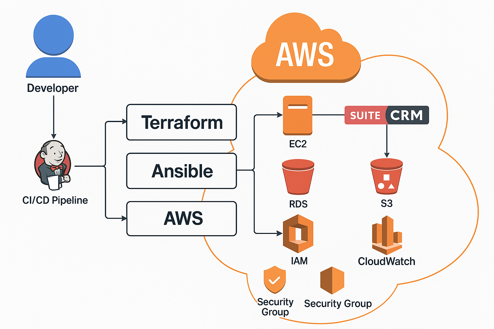

# 🚀 Automated SuiteCRM Deployment on AWS using Terraform and Ansible


---

## 🧑‍💻 About the Project

This project showcases a complete DevOps pipeline for deploying [SuiteCRM](https://suitecrm.com/) on AWS using:

- ✅ Terraform for Infrastructure as Code (IaC)
- ✅ Ansible for Configuration Managementgitignore
- ✅ Jenkins or GitHub Actions for CI/CD pipeline
- ✅ S3 for backups and CloudWatch for monitoring

Ideal for DevOps engineers aiming to demonstrate real-world infrastructure automation, secure application delivery, and AWS best practices.

---

## 📚 Table of Contents

- [Tech Stack](#-tech-stack)
- [Architecture](#-architecture)
- [Folder Structure](#-folder-structure)
- [Setup Instructions](#-setup-instructions)
- [Features](#-features)
- [Screenshots / Demo](#-screenshots--demo)
- [License](#-license)
- [Author](#-author)
- [Connect](#-connect)

---

## 🚀 Tech Stack

- Cloud: AWS (EC2, RDS, S3, IAM, CloudWatch)
- IaC: Terraform
- Config Management: Ansible
- CI/CD: Jenkins or GitHub Actions
- Web Stack: Apache, PHP, MySQL, SuiteCRM
- Backup: S3 + Shell Script
- Monitoring: CloudWatch

---

## 🧱 Folder Structure

```bash
automated-suitecrm-deployment-on-aws-using-terraform-and-ansible/
├── terraform/         # Infrastructure provisioning (VPC, EC2, RDS, S3, etc.)
│   ├── main.tf
│   ├── variables.tf
│   └── outputs.tf
│
├── ansible/           # Configuration management (LAMP stack + SuiteCRM setup)
│   ├── inventory
│   ├── install-lamp.yml
│   ├── deploy-suitecrm.yml
│   └── backup-suitecrm.yml
│
├── jenkins/           # CI/CD pipeline config (optional)
│   └── Jenkinsfile
│
├── scripts/           # Shell scripts for backup automation
│   └── suitecrm-backup.sh
│
├── diagrams/          # Architecture diagrams and visual docs
│   ├── architecture-diagram.png
│   └── architecture-explanation.md
│
├── .gitignore         # Git ignored files
└── README.md          # Project documentation
```

---

## 🏗 Architecture



See `diagrams/architecture-explanation.md` for a detailed breakdown of this diagram.

---

##  Setup Instructions

### 1️⃣ Provision Infra with Terraform

```bash
cd terraform
terraform init
terraform apply
```

### 2️⃣ Configure EC2 with Ansible

```bash
cd ansible
ansible-playbook -i inventory install-lamp.yml
ansible-playbook -i inventory deploy-suitecrm.yml
```

### 3️⃣ Setup CI/CD Pipeline

- Use `jenkins/Jenkinsfile` for Jenkins.
- GitHub Actions option coming soon.

### 4️⃣ Automate Backups to S3

```bash
crontab -e
# Add the following line:
0 2 * * * /home/ubuntu/scripts/suitecrm-backup.sh
```

---

## ✨ Features

- 🔁 End-to-end automation (Infrastructure + Application + Pipeline)
- ☁️ AWS-native infrastructure using best practices
- 🐧 LAMP stack and SuiteCRM deployment with Ansible
- 🔐 IAM-based secure access and VPC-level isolation
- 📦 S3-based backups with lifecycle policies
- 📈 Monitoring and alerting with CloudWatch

---

## 🖼 Screenshots / Demo

> 📌 Add screenshots or CLI logs from Jenkins, Terraform apply, Ansible, and SuiteCRM UI here

---

## 🪪 License

This project is licensed under the [MIT License](LICENSE).

---

## 👤 Author

**Anshu Aditya**  
DevOps Engineer | AWS | Python Automation

---

## 💬 Connect

- LinkedIn: https://www.linkedin.com/in/anshu-aditya/
- GitHub: https://github.com/anshu-aditya/

---

🗓 Updated: June 09, 2025
